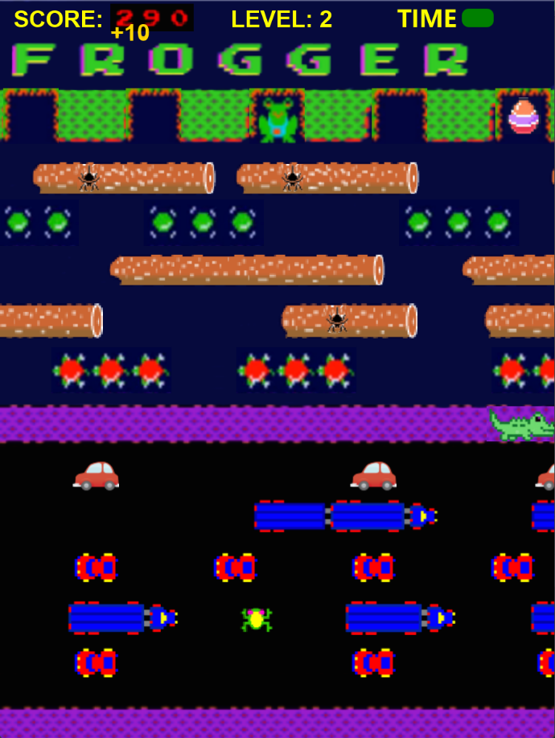

# **Frogger Game (1981) - Enhanced Edition**

## **Project Overview**
This project reimagines the classic Frogger game, introducing new features and challenges while maintaining the nostalgic essence of the original. Developed with a focus on clean architecture and scalability, the game leverages MVC design, SOLID principles, and best practices to ensure maintainability and extensibility.

---

## **Key Features**
1. **Dynamic Levels**
    - The game gets progressively harder with each level, introducing faster-moving obstacles and additional challenges.

2. **Random Bonuses**
    - **Easter Eggs**: Appear randomly at endpoints, rewarding players with bonus points upon collection.
    - **Spiders**: Randomly spawn on logs, offering extra points when eaten by the frog.

3. **Moving Crocodiles**
    - Crocodiles roam the middle of the screen, increasing the game’s difficulty as they can eliminate the player’s frog.

4. **Time Constraint**
    - A countdown timer requires players to complete each level within a set duration or face game over.

5. **Score and High Scores**
    - Dynamic score updates based on player performance, with high scores tracked and displayed via a dedicated menu.

---

## **How to Play**
1. Use the **W, A, S, D** keys to navigate your frog across the screen.
2. Avoid obstacles such as cars, crocodiles, and water hazards while moving to the endpoints.
3. Collect spiders and reach endpoints with Easter eggs to score bonus points.
4. Beat the timer to progress to the next level.

---

## **Key Technical Highlights**
1. **MVC Architecture**
    - The project separates the game logic (model), user interface (view), and interaction handling (controller) for better maintainability.

2. **Dynamic Actor Management**
    - Actors such as logs, turtles, and crocodiles are dynamically added and managed using the `GameObjectFactory` and `LevelComposite`.

3. **Time Management**
    - The `TimeBar` component tracks and displays the remaining time for each level, with visual cues for critical thresholds.

4. **Event Handling**
    - Input events are managed by `KeyEventManager` for responsive gameplay.
    - Game state changes (e.g., victory, game over) are handled via `GameEventListener`, following the Observer Pattern.

5. **High Score System**
    - A `HighScoresView` displays historical high scores, offering players a sense of achievement and competition.

---

## **Game Screenshots**
### **Gameplay**

*Dynamic gameplay showcasing moving obstacles, crocodiles, and bonus items.*

---

## Credits
- **Original Game**: Inspired by Frogger (Konami, 1981).
- **Development Tools**:
   - JavaFX: Used for creating the graphical user interface.
   - Gradle: Utilized for project management, builds, and dependency management.
- **Testing Framework**: JUnit: Implemented for unit and integration testing.
- **References**:
   - [Frogger - Wikipedia](https://en.wikipedia.org/wiki/Frogger): Background information and inspiration.
   - Coursework guidance and resources provided by Nottingham University.

